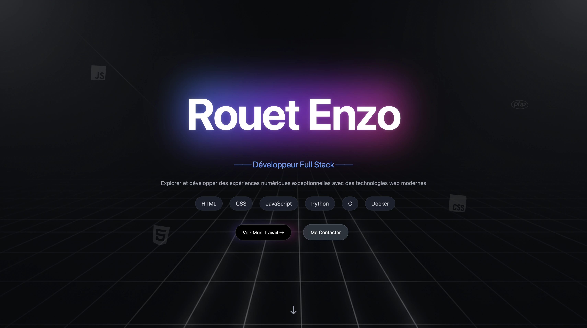

# 🚀 Professional Portfolio - Full Stack Showcase

**Projet central** servant de vitrine à mes compétences techniques et à mes réalisations.
Une plateforme web complète intégrant une interface utilisateur dynamique et un micro-service Backend pour la gestion sécurisée des communications.

**Visité le site :** [https://enzorouet.github.io/Portfolio/](https://enzorouet.github.io/Portfolio/)



## 🎯 Contexte & Objectifs Pédagogiques

Ce projet a été conçu dans le cadre de mon **parcours de formation en autodidacte** pour démontrer ma capacité à livrer un produit fini, du design à l'architecture serveur.

L'objectif était de créer une expérience utilisateur fluide tout en appliquant des concepts de sécurité backend indispensables en production.

**Objectifs validés :**

- Développement d'une **interface Responsive** sans framework (CSS Grid & Flexbox).
- Implémentation d'un **micro-service Backend (Node.js/Express)**.
- Consommation d'API tierces (Resend) pour le traitement des mails.
- Sécurisation des échanges via la gestion des **CORS** et des variables d'environnement (`dotenv`).
- Déploiement multi-plateforme : Frontend sur **GitHub Pages** et Backend sur **Vercel**.

## 🛠️ Stack Technique

- **Frontend :** HTML5, CSS3, JavaScript Vanilla.
- **Backend :** Node.js, Express.js.
- **Sécurité & Services :** API Resend, CORS, Dotenv.
- **DevOps :** Workflow Git, Vercel (Build & Deploy).

## ✨ Fonctionnalités Développées

### 1. Service de Contact Sécurisé (Anti-Spam)

Développement d'une route API dédiée permettant l'envoi de messages sans exposer d'adresse email côté client.

- **Validation :** Filtrage des domaines d'emails temporaires (Yopmail, etc.) pour garantir la qualité des leads.
- **Sécurité :** Limitation des accès via une politique de CORS stricte.

### 2. UI Interactive & Animations

- **Intersection Observer API :** Animation dynamique des barres de progression des compétences lors du scroll.
- **Floating Icons :** Système de décoration en parallaxe légère pour dynamiser le header.
- **Smooth Scrolling :** Navigation interne fluide entre les différentes sections d'expertise.

### 3. SEO & Open Graph

Optimisation complète des meta-tags pour un référencement efficace et une présentation propre lors du partage sur les réseaux sociaux (LinkedIn, Twitter).

## 🏗️ Architecture du Code

Le projet sépare distinctement le client et le serveur :

- **`/assets` & `index.html` :** Partie statique optimisée pour la vitesse de chargement.
- **`server.js` :** Point d'entrée du backend Express gérant les requêtes POST.
- **`vercel.json` :** Configuration du déploiement serverless pour les fonctions Node.js.

## 🧠 Challenges Techniques Résolus

### La communication Cross-Origin (CORS)

Lors du déploiement, le frontend (GitHub Pages) et le backend (Vercel) se trouvaient sur des domaines différents, bloquant les requêtes de formulaire.

- _Solution :_ Configuration fine du middleware `cors` pour autoriser uniquement les requêtes provenant de mon domaine de portfolio, garantissant sécurité et interopérabilité.

### Gestion de l'état du formulaire (UX)

Il fallait éviter les envois multiples et informer l'utilisateur de l'avancement de sa requête.

- _Solution :_ Utilisation d'états visuels dynamiques en JS (désactivation du bouton, changement de texte, retour d'erreur coloré) pour guider l'utilisateur durant l'appel asynchrone à l'API.

## ⚙️ Installation & Lancement

### Local Development

1. **Cloner le projet :**

   ```bash
   git clone [https://github.com/EnzoRouet/Portfolio]
   ```

2. **Installer les dépendances (pour le serveur) :**

```Bash
npm install
```

3. **Configuration : Créez un fichier .env à la racine avec vos clés :**

```Extrait de code
RESEND_API_KEY=your_key
EMAIL_DESTINATION=your_email@example.com
```

4. **Lancer le serveur :**

```Bash
npm start
```
